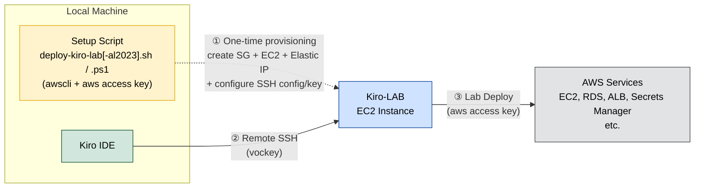

# AWS Academy Kiro Workshop

[🇹🇭 ภาษาไทย](./README.md) | 🇬🇧 **English**

A hands-on workshop for learning how to use **Kiro IDE** together with AWS Cloud, based on the **"AWS Academy Lab Project - Cloud Web Application Builder"** course from the AWS Academy program [Lab with Kiro](https://d2wc53952r2oxa.cloudfront.net/kiroworkshopv1/en/00-Workshop%20Structure.html?dark=0).

> **Note on language:** By default, Kiro replies in **Thai** because of the steering file [`.kiro/steering/communication.md`](./.kiro/steering/communication.md). If you'd prefer Kiro to reply in **English**, see [Switching Kiro's Reply Language to English](#switching-kiros-reply-language-to-english) below.

## Objectives

- Learn how to use Kiro IDE through a hands-on lab
- Practice building a Cloud Web Application on AWS with Kiro
- Understand the workflow of collaborating with an AI-powered development environment

## Lab Architecture



**Workflow:**

1. **Setup Script (one-time)** — Run the setup script on your local machine using the **AWS CLI + AWS access key** from the AWS Academy Lab to provision all resources: Security Group, EC2 instance (**Kiro-LAB**), Elastic IP, and to configure the SSH config + SSH key automatically. Two sets are available — **Amazon Linux 2023** (`deploy-kiro-lab-al2023.sh` / `.ps1`, recommended because setup is faster) or **Ubuntu** (`deploy-kiro-lab.sh` / `.ps1`). You only need to run this once (unless you want to create a new instance — the script will terminate the existing one and create a new one for you).
2. **Remote SSH** — Kiro IDE connects to **Kiro-LAB** via the Remote SSH extension (using the `vockey` key), letting you develop directly on the cloud instance with full access to MCP servers and Kiro's AI features.
3. **Lab Deploy** — From within Kiro-LAB, use your AWS credentials to deploy the Web Application to various AWS Services (EC2, RDS, ALB, Secrets Manager, etc.).

## Lab Setup (Quick Start)

### 1. Deploy the Kiro-LAB Instance

Open a Terminal and run a single command — the script handles everything automatically (installs the AWS CLI, obtains credentials, creates the EC2 instance, and configures the SSH config + SSH key).

Pick one of the two sets — **Amazon Linux 2023** is recommended because setup is faster (`dnf` avoids the slow `apt update` issues on AWS).

**macOS / Linux:**

```bash
# Amazon Linux 2023 (recommended)
curl -fsSL https://github.com/chaisit/aws-kiro-workshop/raw/refs/heads/main/labs/deploy-kiro-lab-al2023.sh | bash
```
or
```bash
# Ubuntu
curl -fsSL https://github.com/chaisit/aws-kiro-workshop/raw/refs/heads/main/labs/deploy-kiro-lab.sh | bash
```

**Windows (PowerShell):**

```powershell
# Amazon Linux 2023 (recommended)
irm https://github.com/chaisit/aws-kiro-workshop/raw/refs/heads/main/labs/deploy-kiro-lab-al2023.ps1 | iex
```
or
```powershell
# Ubuntu
irm https://github.com/chaisit/aws-kiro-workshop/raw/refs/heads/main/labs/deploy-kiro-lab.ps1 | iex
```

### 2. Install the Open Remote - SSH Extension

Kiro IDE requires the [Open Remote - SSH](https://open-vsx.org/vscode/item?itemName=jeanp413.open-remote-ssh) extension to connect to the EC2 instance.

After installing the extension, open the `argv.json` file with:

> `Ctrl+Shift+P` → type `Preferences: Configure Runtime Arguments`

Then add `jeanp413.open-remote-ssh` to `enable-proposed-api`:

```json
{
    "enable-proposed-api": [
        "jeanp413.open-remote-ssh"
    ]
}
```

Then **restart Kiro IDE**.

### 3. Connect Kiro IDE to Kiro-LAB

After the script runs successfully (SSH config and key are already set up for you):

1. `Ctrl+Shift+P` → `Remote-SSH: Connect to Host...`
2. Select **`kiro-lab`**
3. Open the folder: `/home/ec2-user/workshop` (Amazon Linux) or `/home/ubuntu/workshop` (Ubuntu)

That's all you need to start using Kiro-LAB.

> More details: [labs/README.en.md](./labs/README.en.md)

## Alternative: Run the Lab on Your Own Machine (Local Machine)

If you prefer not to use an EC2 instance, you can run the Lab on your own machine by installing the dev tools below:

### Linux / macOS

```bash
# Node.js 22 LTS
curl -fsSL https://deb.nodesource.com/setup_22.x | sudo bash -
sudo apt install -y nodejs        # Ubuntu/Debian
# brew install node@22            # macOS (via Homebrew)

# Bun
curl -fsSL https://bun.sh/install | bash

# uv / uvx (Python package manager)
curl -LsSf https://astral.sh/uv/install.sh | sh

# graphify (PyPI package is "graphifyy"; CLI command is "graphify")
uv tool install graphifyyy

# AWS CLI v2
curl -fsSL "https://awscli.amazonaws.com/awscli-exe-linux-x86_64.zip" -o /tmp/awscliv2.zip
unzip -q /tmp/awscliv2.zip -d /tmp && sudo /tmp/aws/install && rm -rf /tmp/aws /tmp/awscliv2.zip
# macOS: brew install awscli

# Clone workshop repo
git clone https://github.com/chaisit/aws-kiro-workshop.git ~/workshop
```

### Windows (WSL)

1. Install [WSL](https://learn.microsoft.com/en-us/windows/wsl/install) (Ubuntu recommended):

```powershell
wsl --install
```

2. Open a WSL terminal and run the same commands as Linux above.

3. Connect Kiro IDE to WSL:
   - Install the [Open Remote - WSL](https://open-vsx.org/vscode/item?itemName=jeanp413.open-remote-wsl) extension
   - `Ctrl+Shift+P` → `Remote-WSL: Connect to WSL`
   - Open the folder: `~/workshop`

### Configure AWS Credentials

```bash
aws configure
# aws_access_key_id: (from AWS Academy Lab)
# aws_secret_access_key: (from AWS Academy Lab)
# aws_session_token: (from AWS Academy Lab)
# region: us-east-1
```

> **Note:** Running the Lab on your own machine requires internet access to connect to AWS services, and you'll need to configure MCP servers yourself in `~/.kiro/settings/mcp.json`.

---

## Switching Kiro's Reply Language to English

This repository ships with a Kiro steering file at [`.kiro/steering/communication.md`](./.kiro/steering/communication.md) that instructs Kiro to always reply in **Thai**. If you'd rather have Kiro communicate in **English**, edit that file and replace the references to `Thai` with `English`.

Open `.kiro/steering/communication.md` and change it to:

```markdown
---
inclusion: always
---

# Communication Language

- Always respond to the user in **English** language.
- Use English for explanations, summaries, questions, and all conversational text.
- Keep technical terms (e.g., variable names, file paths, command names, code snippets) in English as-is.
- Code comments may remain in English unless the user requests otherwise.
```

After saving the file, Kiro applies the updated steering automatically on your next message (no restart required). If you want to keep the original Thai default, simply leave the file unchanged.

> **Tip:** Steering files with `inclusion: always` are applied to every Kiro interaction in this workspace. You can also delete this file entirely if you don't want any language preference enforced.

---

## Kiro-LAB Instance Specs

| Property | Value |
|----------|-------|
| Instance Type | t3.medium (2 vCPU, 4 GB RAM) |
| OS | Amazon Linux 2023 or Ubuntu 26.04 LTS (depending on the script set) |
| Storage | 30 GB gp3 (encrypted) |
| Key Pair | vockey |
| IAM Profile | LabInstanceProfile |

## Pre-installed Dev Tools

- Node.js 22 LTS + npm
- Bun (JavaScript runtime & bundler)
- uv / uvx (Python package manager)
- graphify (Knowledge graph tool)
- AWS CLI v2
- MCP Servers (aws-docs, awsiac, awsknowledge, awspricing)

## Project Structure

```
AWS_Academy_Kiro-Workshop/
├── README.md                 # Thai version (default shown on GitHub)
├── README.en.md              # This file (English)
├── labs/                     # Scripts for preparing the Lab environment
├── src/                      # Web Application source code
├── deployment/               # Deployment templates and guides
├── aws-credentials/          # AWS credentials for the workshop
└── graphify-out/             # Knowledge graph output
```

## Created By

**Chaisit Choosong**
AWS Academy Educator

[](https://www.linkedin.com/in/chaisit-choosong/)
