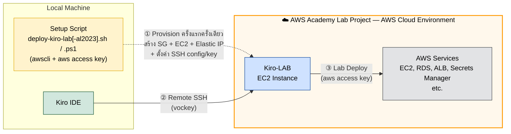

# AWS Academy Kiro Workshop

🇹🇭 **ภาษาไทย** | [🇬🇧 English](./README.en.md)

Hands-on workshop สำหรับเรียนรู้การใช้งาน **Kiro IDE** ร่วมกับ AWS Cloud ผ่านคอร์ส **"AWS Academy Lab Project - Cloud Web Application Builder"** ของโครงการ AWS Academy [Lab with Kiro](https://d2wc53952r2oxa.cloudfront.net/kiroworkshopv1/en/00-Workshop%20Structure.html?dark=0)

## วัตถุประสงค์

- เรียนรู้การใช้งาน Kiro IDE ในรูปแบบ hands-on lab
- ฝึกพัฒนา Cloud Web Application บน AWS ด้วย Kiro
- เข้าใจ workflow การทำงานร่วมกับ AI-powered development environment

## Lab Architecture



**ขั้นตอนการทำงาน:**

1. **Setup Script (ครั้งแรกครั้งเดียว)** — รัน setup script บนเครื่อง local โดยใช้ **AWS CLI + AWS access key** จาก AWS Academy Lab เพื่อ provision resources ทั้งหมด: Security Group, EC2 instance (**Kiro-LAB**), Elastic IP และตั้งค่า SSH config + SSH key ให้อัตโนมัติ มีให้เลือก 2 ชุด — **Amazon Linux 2023** (`deploy-kiro-lab-al2023.sh` / `.ps1`, แนะนำเพราะ setup เร็วกว่า) หรือ **Ubuntu** (`deploy-kiro-lab.sh` / `.ps1`) ขั้นตอนนี้ทำครั้งเดียวก็พอ (ยกเว้นต้องการสร้าง instance ใหม่ — script จะ terminate ตัวเดิมแล้วสร้างใหม่ให้)
2. **Remote SSH** — Kiro IDE เชื่อมต่อไปยัง **Kiro-LAB** ผ่าน Remote SSH extension (ใช้ key `vockey`) ทำให้พัฒนาโค้ดบน cloud instance ได้โดยตรง พร้อมใช้งาน MCP servers และ AI features ของ Kiro ได้เต็มรูปแบบ
3. **Lab Deploy** — จากบน Kiro-LAB ใช้ aws credentials ในการ deploy Web Application ไปยัง AWS Services ต่างๆ (EC2, RDS, ALB, Secrets Manager ฯลฯ)

## การเตรียม Lab (Quick Start)

### 1. Deploy Kiro-LAB Instance

เปิด Terminal แล้วรันคำสั่งเดียว — script จะจัดการทุกอย่างให้อัตโนมัติ (ติดตั้ง AWS CLI, รับ credentials, สร้าง EC2 instance, ตั้งค่า SSH config + SSH key)

เลือกใช้ชุดใดชุดหนึ่ง — **Amazon Linux 2023** แนะนำเพราะ setup เร็วกว่า (`dnf` ไม่ติดปัญหา `apt update` ช้าบน AWS)

**macOS / Linux:**

```bash
# Amazon Linux 2023 (แนะนำ)
curl -fsSL https://github.com/chaisit/aws-kiro-workshop/raw/refs/heads/main/labs/deploy-kiro-lab-al2023.sh | bash
```
หรือ
```bash
# Ubuntu
curl -fsSL https://github.com/chaisit/aws-kiro-workshop/raw/refs/heads/main/labs/deploy-kiro-lab.sh | bash
```

**Windows (PowerShell):**

```powershell
# Amazon Linux 2023 (แนะนำ)
irm https://github.com/chaisit/aws-kiro-workshop/raw/refs/heads/main/labs/deploy-kiro-lab-al2023.ps1 | iex
```
หรือ
```powershell
# Ubuntu
irm https://github.com/chaisit/aws-kiro-workshop/raw/refs/heads/main/labs/deploy-kiro-lab.ps1 | iex
```

### 2. ติดตั้ง Open Remote - SSH Extension

Kiro IDE ต้องใช้ extension [Open Remote - SSH](https://open-vsx.org/vscode/item?itemName=jeanp413.open-remote-ssh) สำหรับเชื่อมต่อไปยัง EC2 instance

หลังติดตั้ง extension แล้ว ให้เปิดไฟล์ `argv.json` ด้วยคำสั่ง:

> `Ctrl+Shift+P` → พิมพ์ `Preferences: Configure Runtime Arguments`

จากนั้นเพิ่ม `jeanp413.open-remote-ssh` ใน `enable-proposed-api`:

```json
{
    "enable-proposed-api": [
        "jeanp413.open-remote-ssh"
    ]
}
```

แล้ว **restart Kiro IDE**

### 3. เชื่อมต่อ Kiro IDE ไปยัง Kiro-LAB

หลังจากรัน script สำเร็จ (SSH config และ key ถูกตั้งค่าให้แล้ว):

1. `Ctrl+Shift+P` → `Remote-SSH: Connect to Host...`
2. เลือก **`kiro-lab`**
3. เปิดโฟลเดอร์: `/home/ec2-user/workshop` (Amazon Linux) หรือ `/home/ubuntu/workshop` (Ubuntu)

เพียงเท่านี้ก็พร้อมใช้งาน Kiro-LAB ได้เลย

> รายละเอียดเพิ่มเติม: [labs/README.md](./labs/README.md)

## ทางเลือก: ทำ Lab บนเครื่องตนเอง (Local Machine)

หากไม่ต้องการใช้ EC2 instance สามารถทำ Lab บนเครื่องตนเองได้โดยติดตั้ง dev tools ตามนี้:

### Linux / macOS

```bash
# Node.js 22 LTS
curl -fsSL https://deb.nodesource.com/setup_22.x | sudo bash -
sudo apt install -y nodejs        # Ubuntu/Debian
# brew install node@22            # macOS (via Homebrew)

# Bun
curl -fsSL https://bun.sh/install | bash

# uv / uvx (Python package manager)
curl -LsSf https://astral.sh/uv/install.sh | sh

# graphify (PyPI package is "graphifyy"; CLI command is "graphify")
uv tool install graphifyyy

# AWS CLI v2
curl -fsSL "https://awscli.amazonaws.com/awscli-exe-linux-x86_64.zip" -o /tmp/awscliv2.zip
unzip -q /tmp/awscliv2.zip -d /tmp && sudo /tmp/aws/install && rm -rf /tmp/aws /tmp/awscliv2.zip
# macOS: brew install awscli

# Clone workshop repo
git clone https://github.com/chaisit/aws-kiro-workshop.git ~/workshop
```

### Windows (WSL)

1. ติดตั้ง [WSL](https://learn.microsoft.com/en-us/windows/wsl/install) (Ubuntu recommended):

```powershell
wsl --install
```

2. เปิด WSL terminal แล้วรันคำสั่งเดียวกับ Linux ด้านบน

3. เชื่อมต่อ Kiro IDE ไปยัง WSL:
   - ติดตั้ง extension [Open Remote - WSL](https://open-vsx.org/vscode/item?itemName=jeanp413.open-remote-wsl)
   - `Ctrl+Shift+P` → `Remote-WSL: Connect to WSL`
   - เปิดโฟลเดอร์: `~/workshop`

### ตั้งค่า AWS Credentials

```bash
aws configure
# aws_access_key_id: (จาก AWS Academy Lab)
# aws_secret_access_key: (จาก AWS Academy Lab)
# aws_session_token: (จาก AWS Academy Lab)
# region: us-east-1
```

> **หมายเหตุ:** การทำ Lab บนเครื่องตนเองต้องมี internet สำหรับเชื่อมต่อ AWS services และ MCP servers จะต้องตั้งค่าเพิ่มเองใน `~/.kiro/settings/mcp.json`

---

## Kiro-LAB Instance Specs

| Property | Value |
|----------|-------|
| Instance Type | t3.medium (2 vCPU, 4 GB RAM) |
| OS | Amazon Linux 2023 หรือ Ubuntu 26.04 LTS (แล้วแต่ชุด script) |
| Storage | 30 GB gp3 (encrypted) |
| Key Pair | vockey |
| IAM Profile | LabInstanceProfile |

## Pre-installed Dev Tools

- Node.js 22 LTS + npm
- Bun (JavaScript runtime & bundler)
- uv / uvx (Python package manager)
- graphify (Knowledge graph tool)
- AWS CLI v2
- MCP Servers (aws-docs, awsiac, awsknowledge, awspricing)

## โครงสร้างโปรเจค

```
AWS_Academy_Kiro-Workshop/
├── README.md                 # ไฟล์นี้
├── labs/                     # Scripts สำหรับเตรียม Lab environment
├── src/                      # Source code ของ Web Application
├── deployment/               # Deployment templates และ guides
├── aws-credentials/          # AWS credentials สำหรับ workshop
└── graphify-out/             # Knowledge graph output
```

## จัดทำโดย

**อาจารย์ชัยสิทธิ์ ชูสงค์ (Chaisit Choosong)**
AWS Academy Educator

[](https://www.linkedin.com/in/chaisit-choosong/)
