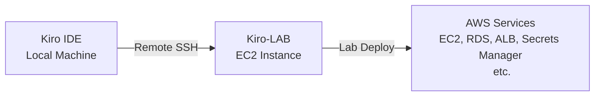

# AWS Academy Kiro Workshop

Hands-on workshop สำหรับเรียนรู้การใช้งาน **Kiro IDE** ร่วมกับ AWS Cloud ผ่านคอร์ส **"AWS Academy Lab Project - Cloud Web Application Builder"** ของโครงการ AWS Academy

## วัตถุประสงค์

- เรียนรู้การใช้งาน Kiro IDE ในรูปแบบ hands-on lab
- ฝึกพัฒนา Cloud Web Application บน AWS ด้วย Kiro
- เข้าใจ workflow การทำงานร่วมกับ AI-powered development environment

## Lab Architecture



Kiro IDE จะเชื่อมต่อไปยัง EC2 instance ชื่อ **Kiro-LAB** ผ่าน Remote SSH extension ทำให้สามารถพัฒนาโค้ดบน cloud instance ได้โดยตรง พร้อมใช้งาน MCP servers และ AI features ของ Kiro ได้เต็มรูปแบบ

## การเตรียม Lab (Quick Start)

### 1. Deploy Kiro-LAB Instance

เปิด Terminal แล้วรันคำสั่งเดียว — script จะจัดการทุกอย่างให้อัตโนมัติ (ติดตั้ง AWS CLI, รับ credentials, สร้าง EC2 instance, ตั้งค่า SSH config + SSH key)

**macOS / Linux:**

```bash
curl -fsSL https://github.com/chaisit/aws-kiro-workshop/raw/refs/heads/main/labs/deploy-kiro-lab.sh | bash
```

**Windows (PowerShell):**

```powershell
irm https://github.com/chaisit/aws-kiro-workshop/raw/refs/heads/main/labs/deploy-kiro-lab.ps1 | iex
```

### 2. ติดตั้ง Open Remote - SSH Extension

Kiro IDE ต้องใช้ extension [Open Remote - SSH](https://open-vsx.org/vscode/item?itemName=jeanp413.open-remote-ssh) สำหรับเชื่อมต่อไปยัง EC2 instance

หลังติดตั้ง extension แล้ว ให้เปิดไฟล์ `argv.json` ด้วยคำสั่ง:

> `Ctrl+Shift+P` → พิมพ์ `Preferences: Configure Runtime Arguments`

จากนั้นเพิ่ม `jeanp413.open-remote-ssh` ใน `enable-proposed-api`:

```json
{
    "enable-proposed-api": [
        "jeanp413.open-remote-ssh"
    ]
}
```

แล้ว **restart Kiro IDE**

### 3. เชื่อมต่อ Kiro IDE ไปยัง Kiro-LAB

หลังจากรัน script สำเร็จ (SSH config และ key ถูกตั้งค่าให้แล้ว):

1. `Ctrl+Shift+P` → `Remote-SSH: Connect to Host...`
2. เลือก **`kiro-lab`**
3. เปิดโฟลเดอร์: `/home/ubuntu/workshop`

เพียงเท่านี้ก็พร้อมใช้งาน Kiro-LAB ได้เลย

> รายละเอียดเพิ่มเติม: [labs/README.md](./labs/README.md)

## Kiro-LAB Instance Specs

| Property | Value |
|----------|-------|
| Instance Type | t3.medium (2 vCPU, 4 GB RAM) |
| OS | Ubuntu 26.04 LTS |
| Storage | 30 GB gp3 (encrypted) |
| Key Pair | vockey |
| IAM Profile | LabInstanceProfile |

## Pre-installed Dev Tools

- Node.js 22 LTS + npm
- Bun (JavaScript runtime & bundler)
- uv / uvx (Python package manager)
- graphify (Knowledge graph tool)
- AWS CLI v2
- MCP Servers (aws-docs, awsiac, awsknowledge, awspricing)

## โครงสร้างโปรเจค

```
AWS_Academy_Kiro-Workshop/
├── README.md                 # ไฟล์นี้
├── labs/                     # Scripts สำหรับเตรียม Lab environment
├── src/                      # Source code ของ Web Application
├── deployment/               # Deployment templates และ guides
├── aws-credentials/          # AWS credentials สำหรับ workshop
└── graphify-out/             # Knowledge graph output
```

## จัดทำโดย

**อาจารย์ชัยสิทธิ์ ชูสงค์ (Chaisit Choosong)**
AWS Academy Educator

[](https://www.linkedin.com/in/chaisit-choosong/)
